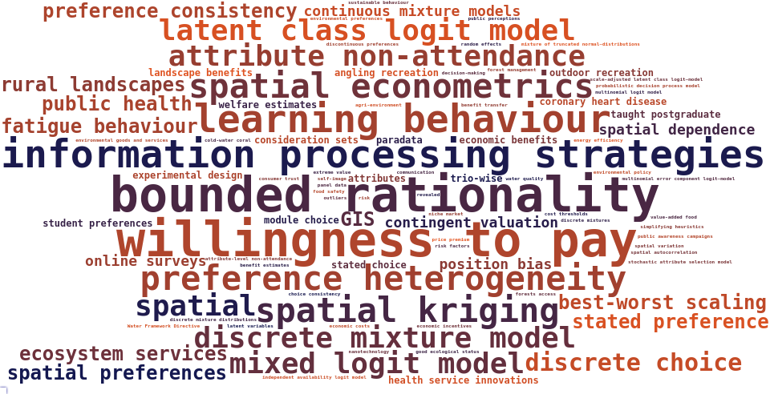
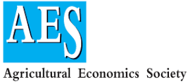

# Experience

## Biography

I hold a PhD in Environmental Economics from Queen’s University of Belfast. In 2018, I was appointed professor of economics in the University of Stirling Management School.

```{r setup, include=FALSE, eval=FALSE}
knitr::opts_chunk$set(collapse = TRUE)

library(wordcloud)
library(RColorBrewer)
library(wordcloud2)
library(tm)
library(htmlwidgets)
library(webshot)

df <- c('trio-wise',	'trio-wise',	'taught~postgraduate',	'taught~postgraduate',	'module~choice',	'student~preferences',	'module~choice',	'student~preferences',	'cold-water~coral',	'ecosystem~services',	'ecosystem~services',	'ecosystem~services',	'ecosystem~services',	'contingent~valuation',	'contingent~valuation',	'forest~management',	'spatial~econometrics',	'spatial~econometrics',	'spatial~econometrics',	'spatial~econometrics',	'spatial~econometrics',	'spatial~econometrics',	'spatial~econometrics',	'angling~recreation',	'angling~recreation',	'online~surveys',	'online~surveys',	'online~surveys',	'paradata',	'paradata',	'response~latency',	'response~latency',	'response~latency',	'response~latency',	'response~latency',	'GIS',	'GIS',	'GIS',	'GIS',	'revealed',	'spatial',	'spatial',	'spatial',	'spatial',	'spatial',	'spatial',	'agri-environment',	'attribute~non-attendance',	'attribute~non-attendance',	'attribute~non-attendance',	'attribute~non-attendance',	'attribute~non-attendance',	'attribute~non-attendance',	'attribute-level~non-attendance',	'attributes',	'attributes',	'benefit~estimates',	'benefit~transfer',	'best-worst~scaling',	'best-worst~scaling',	'best-worst~scaling',	'best-worst~scaling',	'bounded~rationality',	'bounded~rationality',	'bounded~rationality',	'bounded~rationality',	'bounded~rationality',	'bounded~rationality',	'bounded~rationality',	'bounded~rationality',	'bounded~rationality',	'bounded~rationality',	'choice~consistency',	'communication',	'consideration~sets',	'consideration~sets',	'consumer~trust',	'contingent~valuation',	'continuous~mixture~models',	'continuous~mixture~models',	'continuous~mixture~models',	'coronary~heart~disease',	'coronary~heart~disease',	'cost~thresholds',	'decision-making',	'discontinuous~preferences',	'discrete~choice',	'discrete~choice',	'discrete~choice',	'discrete~choice',	'discrete~choice',	'discrete~mixture~distributions',	'discrete~mixture~model',	'discrete~mixture~model',	'discrete~mixture~model',	'discrete~mixture~model',	'discrete~mixture~model',	'discrete~mixture~model',	'discrete~mixtures',	'economic~benefits',	'economic~benefits',	'economic~costs',	'economic~incentives',	'elimination~by~aspects',	'elimination~by~aspects',	'elimination~by~aspects',	'elimination~by~aspects',	'elimination~by~aspects',	'energy~efficiency',	'environmental~goods~and~services',	'environmental~policy',	'environmental~preferences',	'experimental~design',	'experimental~design',	'extreme~value',	'fatigue~behaviour',	'fatigue~behaviour',	'fatigue~behaviour',	'fatigue~behaviour',	'food~choice~and~preferences',	'food~choice~and~preferences',	'food~choice~and~preferences',	'food~choice~and~preferences',	'food~safety',	'forests~access',	'good~ecological~status',	'health~service~innovations',	'health~service~innovations',	'independent~availability~logit~model',	'information~processing~strategies',	'information~processing~strategies',	'information~processing~strategies',	'information~processing~strategies',	'information~processing~strategies',	'information~processing~strategies',	'information~processing~strategies',	'information~processing~strategies',	'landscape~benefits',	'landscape~benefits',	'latent~class~logit~model',	'latent~class~logit~model',	'latent~class~logit~model',	'latent~class~logit~model',	'latent~class~logit~model',	'latent~class~logit~model',	'latent~variables',	'learning~behaviour',	'learning~behaviour',	'learning~behaviour',	'learning~behaviour',	'learning~behaviour',	'learning~behaviour',	'learning~behaviour',	'learning~behaviour',	'mixed~logit~model',	'mixed~logit~model',	'mixed~logit~model',	'mixed~logit~model',	'mixed~logit~model',	'mixed~logit~model',	'mixture~of~truncated~normal~distributions',	'multinomial~error~component~logit~model',	'multinomial~logit~model',	'nanotechnology',	'niche~market',	'non-market~valuation',	'non-market~valuation',	'non-market~valuation',	'non-market~valuation',	'non-market~valuation',	'outdoor~recreation',	'outdoor~recreation',	'outliers',	'panel~data',	'position~bias',	'position~bias',	'position~bias',	'preference~consistency')
df2 <- c('preference~consistency',	'preference~consistency',	'preference~consistency',	'preference~formation',	'preference~formation',	'preference~formation',	'preference~formation',	'preference~formation',	'preference~heterogeneity',	'preference~heterogeneity',	'preference~heterogeneity',	'preference~heterogeneity',	'preference~heterogeneity',	'preference~heterogeneity',	'preference~heterogeneity',	'price~premium',	'probabilistic~decision~process~model',	'public~awareness~campaigns',	'public~perceptions',	'public~health',	'public~health',	'public~health',	'public~health',	'random~effects',	'random~parameters~logit~model',	'random~parameters~logit~model',	'random~parameters~logit~model',	'random~parameters~logit~model',	'random~utility~model',	'random~utility~model',	'random~utility~model',	'random~utility~model',	'random~utility~model',	'risk',	'risk~factors',	'rural~landscapes',	'rural~landscapes',	'rural~landscapes',	'rural~landscapes',	'scale-adjusted~latent~class~logit~model',	'selection~by~aspects',	'selection~by~aspects',	'selection~by~aspects',	'selection~by~aspects',	'self-image',	'sequential~Bayesian~experimental~design',	'sequential~Bayesian~experimental~design',	'sequential~Bayesian~experimental~design',	'simplifying~heuristics',	'spatial~autocorrelation',	'spatial~dependence',	'spatial~dependence',	'spatial~dependence',	'spatial~preferences',	'spatial~preferences',	'spatial~preferences',	'spatial~preferences',	'spatial~kriging',	'spatial~kriging',	'spatial~kriging',	'spatial~kriging',	'spatial~kriging',	'spatial~kriging',	'spatial~kriging',	'spatial~variation',	'stated~choice',	'stated~choice',	'stated~choice~experiments',	'stated~choice~experiments',	'stated~choice~experiments',	'stated~choice~experiments',	'stated~choice~experiments',	'stated~choice~experiments',	'stated~choice~experiments',	'stated~choice~experiments',	'stated~choice~experiments',	'stated~choice~experiments',	'stated~choice~experiments',	'stated~choice~experiments',	'stated~preference',	'stated~preference',	'stated~preference',	'stated~preference',	'stochastic~attribute~selection~model',	'sustainable~behaviour',	'value-added~food',	'variance~consistency',	'variance~consistency',	'variance~consistency',	'variance~consistency',	'Water~Framework~Directive',	'water~quality',	'welfare~estimates',	'welfare~estimates',	'willingness~to~pay',	'willingness~to~pay',	'willingness~to~pay',	'willingness~to~pay',	'willingness~to~pay',	'willingness~to~pay',	'willingness~to~pay',	'willingness~to~pay',	'willingness~to~pay',	'willingness~to~pay')

df <- data.frame(V1 = c(df, df2))
library(stringr)
df$V1 <- factor(str_replace(df$V1, "~", " "))
df$V1 <- factor(str_replace(df$V1, "~", " "))
df$V1 <- factor(str_replace(df$V1, "~", " "))

df.words <- data.frame(word=factor(names(table(df$V1))),
                       freq=as.vector(table(df$V1)))

df.words <- df.words[order(-df.words$freq),]

col1 <- "#e35420"
col2 <- "#141850"
colfunc <- colorRampPalette(c(col1, col2))
set.seed(1234567)
cols <- sample(colfunc(nrow(df.words)))

 set.seed(12345)
word.cloud <- wordcloud2(df.words, size = 0.4, minRotation = 0, maxRotation = 0,color=cols,fontFamily = "mono")

saveWidget(word.cloud, file.path(getwd(), "img", "cloud.html"),selfcontained = F)

webshot(file.path(getwd(), "img", "cloud.html"),file.path(getwd(), "img", "cloud.png"), delay =5, vwidth = 480*2, vheight=480)

```


My main expertise is in the development and application of discrete regression and choice models in the areas of environmental economics, health economics and consumer economics. My research explores a range of behavioural and econometric aspects associated with choice methods.

{width=100%}


## Education

:::: {.columns}

::: {.column width="70%"}
**Ph.D.Environmental Economics**

- Queen’s University Belfast, graduated 2006

**M.Sc. in Rural Development**

- Queen’s University Belfast, graduated 2002

**B.Sc. in Agricultural Economics**

- Queen’s University Belfast, graduated 2000
:::

::: {.column width="3%"}
:::

::: {.column width="27%"}
{width=100%}
:::

::::


## Academic appointments

:::: {.columns}

::: {.column width="70%"}
**Professor of Economics**

- Economics Division, University of Stirling (Aug 2018 – Present)

**Senior Lecturer of Economics**

- Economics Division, University of Stirling (Sep 2012 – Jul 2018)
:::

::: {.column width="3%"}
:::

::: {.column width="27%"}
{width=100%}
:::

::::

:::: {.columns}

::: {.column width="70%"}
**Lecturer of Environmental Economics**

- Gibson Institute for Land, Food and Environment, Queen’s University Belfast (Jan 2009 – Aug 2012)

**Post-Doctural Research Fellow of Environmental Economics**

- Gibson Institute for Land, Food and Environment, Queen’s University Belfast (Sept 2006 – Aug 2008)
:::

::: {.column width="3%"}
:::

::: {.column width="27%"}
{width=100%}
:::

::::

## Accomplishments


:::: {.columns}

::: {.column width="70%"}
**Outstanding European Review of Agricultural Economics Journal Article**

- Awared by the European Association of Agricultural Economists in 2020
- Paper titled [Accommodating satisficing behaviour in stated choice experiments](https://doi.org/10.1093/erae/jby021)
- Co-author: Erlend Dancke Sandorf

**Outstanding European Review of Agricultural Economics Journal Article**

- Awared by the European Association of Agricultural Economists in 2019
- Paper titled [Paper titled Using eye tracking to account for attribute non-attendance in choice experiments](https://doi.org/10.1093/erae/jbx035)
- Co-authors: Ellen J. Van Loo, Rodolfo M. Nayga, Han-Seok Seo and Wim Verbeke

:::

::: {.column width="3%"}
:::

::: {.column width="27%"}
{width=100%}
:::

::::


:::: {.columns}

::: {.column width="70%"}
**Outstanding Young Researcher Award for Excellence**

- Awared by the Agricultural Economics Society in 2017
- In recognition for contribution to the field, dissemination of the practice of stated preference methods in policy analysis and support to early career researchers

**Prize Essay Competition**

- Awared by the Agricultural Economics Society in 2007
- Paper titled [Willingness to pay for rural landscape improvements: combining mixed logit and random effects models](https://doi.org/10.1111/j.1477-9552.2007.00117.x)


:::

::: {.column width="3%"}
:::

::: {.column width="27%"}
{width=100%}
:::

::::

:::: {.columns}

::: {.column width="70%"}
**Bob O’Connor Prize**

- Awarded by the Agricultural Economics Society of Ireland in 2006
- Best research by a young researcher in Ireland in the field of agricultural and natural resource economics

:::

::: {.column width="3%"}
:::

::: {.column width="27%"}
{width=100%}
:::

::::


