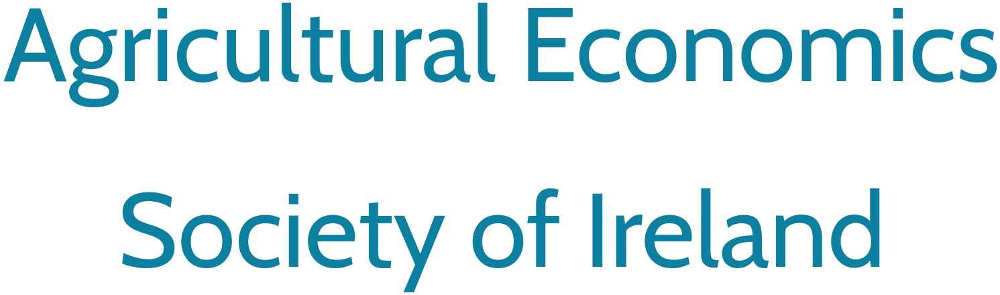

# Experience

## Biography

I hold a PhD in Environmental Economics from Queen’s University of Belfast. In 2018, I was appointed professor of economics in the University of Stirling Management School.

I hold a PhD in Environmental Economics from Queen’s University Belfast and was appointed Professor of Economics at the University of Stirling Management School in 2018. 

My primary expertise lies in the development and application of advanced discrete choice experiments and microeconometric models for revealed and stated preference elicitation. I apply these rigorous methodologies across environmental, cultural, public health, and consumer economics to decode how individuals evaluate trade-offs and make decisions.

## Academic appointments

:::: {.columns}

::: {.column width="70%"}
**Professor in Economics**

- Stirling Business School, University of Stirling | Aug 2018 – Present

**Senior Lecturer in Economics**

- Stirling Management School, University of Stirling | Sep 2012 – Jul 2018
:::

::: {.column width="3%"}
:::

::: {.column width="27%"}
{width=100%}
:::

::::

:::: {.columns}

::: {.column width="70%"}
**Lecturer in Environmental Economics**

- Gibson Institute for Land, Food and Environment, Queen’s University Belfast | Jan 2009 – Aug 2012

**ostdoctoral Research Fellow in Environmental Economics**

- Gibson Institute for Land, Food and Environment, Queen’s University Belfast | Sept 2006 – Aug 2008
:::

::: {.column width="3%"}
:::

::: {.column width="27%"}
{width=100%}
:::

::::

## Education

:::: {.columns}

::: {.column width="70%"}
**Ph.D.Environmental Economics**

- Queen’s University Belfast | Graduated 2006

**M.Sc. in Rural Development**

- Queen’s University Belfast | Graduated 2002

**B.Sc. in Agricultural Economics**

- Queen’s University Belfast | Graduated 2000
:::

::: {.column width="3%"}
:::

::: {.column width="27%"}
{width=100%}
:::

::::

## Awards and recognition

:::: {.columns}

::: {.column width="70%"}
**Outstanding European Review of Agricultural Economics Journal Article**

- European Association of Agricultural Economists | Awarded 2020
- Paper: [*Accommodating satisficing behaviour in stated choice experiments*](https://doi.org/10.1093/erae/jby021)
- Co-author: Erlend Dancke Sandorf

**Outstanding European Review of Agricultural Economics Journal Article**

- European Association of Agricultural Economists | Awarded 2019
- Paper: [*Using eye tracking to account for attribute non-attendance in choice experiments*](https://doi.org/10.1093/erae/jbx035)
- Co-authors: Ellen J. Van Loo, Rodolfo M. Nayga, Han-Seok Seo and Wim Verbeke

:::

::: {.column width="3%"}
:::

::: {.column width="27%"}
{width=100%}
:::

::::

:::: {.columns}

::: {.column width="70%"}
**Outstanding Young Researcher Award for Excellence**

- Agricultural Economics Society | Awarded 2017
- *In recognition of outstanding contributions to the field, dissemination of stated preference methods in policy analysis, and the mentorship of early-career researchers*

**Prize Essay Competition**

- Agricultural Economics Society | Awarded 2007
- Paper: [*Willingness to pay for rural landscape improvements: combining mixed logit and random effects models*](https://doi.org/10.1111/j.1477-9552.2007.00117.x)

:::

::: {.column width="3%"}
:::

::: {.column width="27%"}
{width=100%}
:::

::::

:::: {.columns}

::: {.column width="70%"}
**Bob O’Connor Prize**

- Agricultural Economics Society of Ireland | Awarded 2006
- *Best research paper by a young scholar in Ireland within the fields of agricultural and natural resource economics*

:::

::: {.column width="3%"}
:::

::: {.column width="27%"}
{width=100%}
:::

::::

