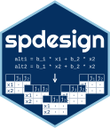

# Software and code

 

I code primarily in R, developing bespoke estimation routines for discrete choice and other limited dependent variable models. My work includes custom log-likelihood functions, simulation-based estimation, welfare analysis, and extensions of mixed logit, latent class, and ICLV models. I also use R extensively for data management, statistical analysis, visualisation, and reproducible research workflows through Quarto and R Markdown.

I build and deploy online survey experiments in Qualtrics, using advanced survey logic, randomisation, embedded data, and custom JavaScript to implement interactive discrete choice experiments and other behavioural research instruments. My research sits at the intersection of survey design, econometric modelling, and policy evaluation, with a strong emphasis on transparent and reproducible analytical workflows.

 

:::: {.columns}

::: {.column width="70%"}
**spdesign: Designing Stated Preference Experiments**

-	Sandorf ED, **Campbell D** (2023). spdesign: Designing Stated Preference Experiments. R package version 0.0.1, [https://CRAN.R-project.org/package=spdesign](https://CRAN.R-project.org/package=spdesign).

:::

::: {.column width="3%"}
:::

::: {.column width="27%"}

[{width=45%}](https://CRAN.R-project.org/package=spdesign)
[{width=45%}](https://CRAN.R-project.org/package=spdesign)

:::

::::

Contemporary software commonly used to design stated preference experiments are expensive and the code is closed source. This is a free software package with an easy to use interface to make flexible stated preference experimental designs using state-of-the-art methods.
